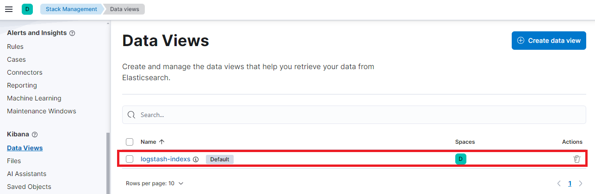

## Задание 1

Вам необходимо поднять в докере и связать между собой:

- elasticsearch (hot и warm ноды);
- logstash;
- kibana;
- filebeat.

Logstash следует сконфигурировать для приёма по tcp json-сообщений.

Filebeat следует сконфигурировать для отправки логов docker вашей системы в logstash.

В директории [help](./help) находится манифест docker-compose и конфигурации filebeat/logstash для быстрого 
выполнения этого задания.

Результатом выполнения задания должны быть:

- скриншот `docker ps` через 5 минут после старта всех контейнеров (их должно быть 5);
- скриншот интерфейса kibana;
- docker-compose манифест (если вы не использовали директорию help);
- ваши yml-конфигурации для стека (если вы не использовали директорию help).

## Ответ 1

1. скриншот `docker ps` через 5 минут после старта всех контейнеров (их должно быть 5)

2. скриншот интерфейса kibana

3. docker-compose манифест (если вы не использовали директорию help). Использовалось сочетание docker-compose манифестов. В результате:

  - Номер версии всего стека elastic-продуктов, номера портов kibana, elastic, logstash, а также предельный размер памяти потребляемой kibana и elastic задаются через переменные окружения в файле .env
  - Выключено сохранение данных на диск с целью повышения скорости поиска(рекомендуемый параметр) - *bootstrap.memory_lock=true*
  - Через переменную среди *ELASTIC_PASSWORD* задается пароль для доступа. Логин по умолчанию *elastic*

  Манифест расположен по [ссылке](docker/docker-compose.yml) 

4.   Конфигурация расположена в файле *[.env](docker/.env)*

## Задание 2

Перейдите в меню [создания index-patterns  в kibana](http://localhost:5601/app/management/kibana/indexPatterns/create) и создайте несколько index-patterns из имеющихся.

Перейдите в меню просмотра логов в kibana (Discover) и самостоятельно изучите, как отображаются логи и как производить поиск по логам.

В манифесте директории help также приведенно dummy-приложение, которое генерирует рандомные события в stdout-контейнера.
Эти логи должны порождать индекс logstash-* в elasticsearch. Если этого индекса нет — воспользуйтесь советами и источниками из раздела «Дополнительные ссылки» этого задания.

## Ответ 2

1. Перешел во вкладку *Stack management*, затем открыл вкладку *Data View*  и создал представление данных *logstash-index*(отличие от паттернов только в том, что у представления еще указывается название, которое может быть любым описательным значением).

2. Перешел на вкладку *Discover*. В выделенной области на рисунке нажал кнопку разворачивания свойств события. Добавил фильтр *container.name* со значением *some_app*. Поменял колонки в представлении вывода для информативности. За период "последние 15 минут" получилось следующее:

